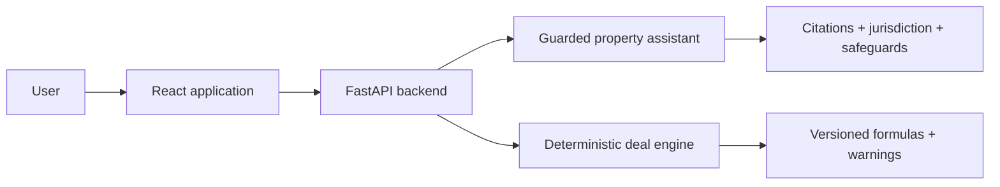

# DiamondEcho

AI-enabled property intelligence and deterministic real-estate deal analysis with responsible-AI safeguards, a React frontend, a FastAPI/Python backend, and automated CI.

## Product principle

DiamondEcho separates probabilistic language assistance from deterministic financial calculations. The assistant layer handles retrieval, citations, jurisdiction checks, fair-housing safeguards, and escalation. The deal engine produces versioned formulas, explicit components, assumptions, and warnings.

## Architecture



## Capabilities

- property intelligence assistant with regulated-topic boundaries
- authoritative citation requirements
- jurisdiction-aware responses
- fair-housing and sensitive-data protections
- deterministic mortgage, rental, flip, and commercial calculations
- rental and flip scenario analysis
- explicit formulas, components, versions, and warnings
- React/FastAPI integration
- frontend tests and production-build validation
- backend pytest execution

## Documentation

- [Property intelligence MVP](backend/ai/README.md)
- [Deal Intelligence V1](backend/deal_intelligence/README.md)
- [CI workflow](.github/workflows/ci.yml)

## Local development

Frontend:

```bash
cd frontend
npm ci
npm start
```

Backend:

```bash
python -m pip install -r backend/requirements.txt
python -m pytest backend/tests
```

## Important boundaries

This MVP does not provide legal, tax, mortgage, lending, appraisal, or investment advice. It does not claim live MLS access, live rates, automated valuation, or professional replacement.

## Portfolio context

This is an AI-assisted build demonstrating product scoping, responsible-AI design, deterministic decision support, full-stack integration, and delivery controls.
